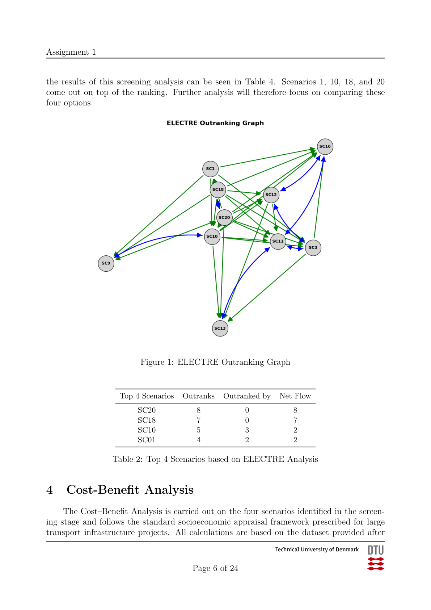
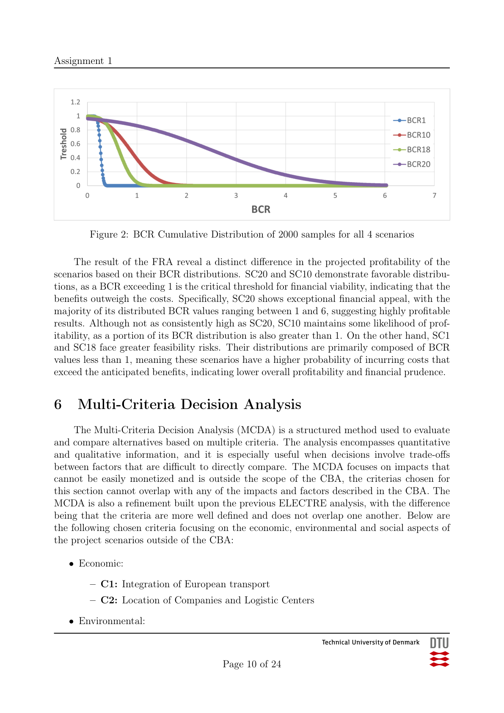
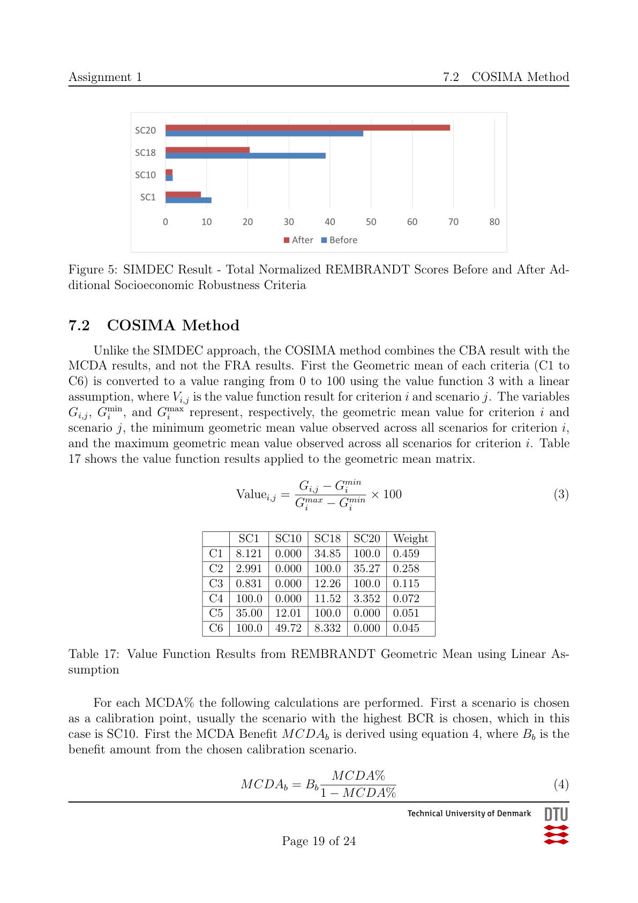
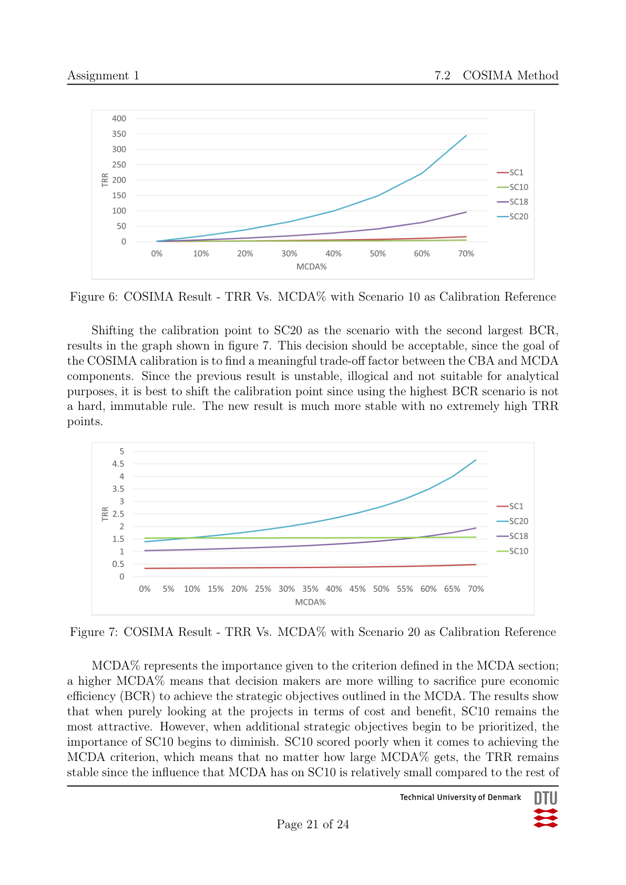

# TEN-T Infrastructure Scenario Appraisal

Decision-support appraisal of EU TEN-T infrastructure scenarios using ELECTRE, cost-benefit analysis (CBA), Monte Carlo simulation, REMBRANDT MCDA, and composite assessment (SIMDEC & COSIMA).

**Course:** Decision Support and Strategic Assessment (DTU)  
**Type:** Group analytical project  
**Final recommendation:** Scenario 20 (SC20)

The objective is to support infrastructure investment decisions by combining economic evaluation with strategic and risk-based analysis.

## Overview
This project evaluates infrastructure scenarios from the EU **Trans-European Transport Network (TEN-T)** portfolio and recommends the most attractive option from an economic and strategic perspective.

The analysis follows a staged decision-support workflow:
1. **Screening analysis (ELECTRE)** to reduce 10 scenarios to the 4 most promising options
2. **Cost-Benefit Analysis (CBA)** for the shortlisted scenarios
3. **Feasibility Risk Assessment (FRA)** using Monte Carlo simulation
4. **Strategic Multi-Criteria Decision Analysis (MCDA)** using the **REMBRANDT** method
5. **Composite assessment** using **SIMDEC** and **COSIMA**

## Problem Statement
The project was structured as an appraisal study for the **European Commission**. The objective was to identify the most attractive TEN-T scenario by combining economic performance with strategic, environmental, and social considerations.

## Methods Used

### 1) ELECTRE screening
The initial screening used six criteria:
- Environmental impact
- Cross-border connectivity and network integration
- Cost
- Complexity and feasibility
- Socio-economic benefits
- Safety and resilience

This stage reduced the original set of **10 scenarios** to **4 shortlisted scenarios: SC01, SC10, SC18, and SC20**.

### 2) Cost-Benefit Analysis (CBA)
For the four shortlisted scenarios, the CBA evaluated:
- Construction / investment costs
- Maintenance costs
- Scrap value
- Consumer surplus
- Air pollution
- Global warming
- Accidents
- Noise

The model used the opening year as year 0, applied a **3% discount rate**, and evaluated impacts over **50 years after construction**.

### 3) Feasibility Risk Assessment (FRA)
A Monte Carlo simulation with **2,000 iterations per scenario** tested the sensitivity of the **Benefit-Cost Ratio (BCR)** to uncertainty in:
- Consumer surplus
- Construction costs

### 4) MCDA with REMBRANDT
The strategic analysis used six criteria that complemented the CBA:
- Integration of European transport
- Location of companies and logistic centers
- Ecosystem and biodiversity loss
- Non-renewable dependence
- Labour market and sociographic job distribution
- Territorial cohesion

### 5) Composite assessment
Two composite approaches were used:
- **SIMDEC**, which added socio-economic robustness from the FRA into the MCDA
- **COSIMA**, which translated the MCDA into CBA terms through shadow prices and TRR analysis

## Key Visuals

### ELECTRE Screening


### FRA – BCR Distribution


### SIMDEC Results


### COSIMA Comparison


## Main Findings
- The ELECTRE screening shortlisted **SC01, SC10, SC18, and SC20**
- In the CBA, **SC10** had the highest **BCR (1.54)**, while **SC20** also performed strongly with **BCR 1.40**
- The FRA showed that **SC20** had the most favorable BCR distribution under uncertainty
- In the MCDA, **SC20** and **SC18** consistently performed strongly across stakeholder viewpoints
- The composite analyses ultimately supported **SC20** as the preferred scenario

## Recommendation
The final recommendation of the project is **SC20**, because it combines:
- strong economic performance
- robust performance under uncertainty
- strong alignment with the strategic objectives captured by the MCDA

## Repository Structure
```text
.
├── README.md
├── docs/
│   ├── final-report.pdf
│   └── project-brief.pdf
├── notebooks/
│   └── electre_analysis.ipynb
├── data/
│   ├── electre-input.csv
│   └── electre-weights.csv
├── models/
│   ├── electre-model.xlsx
│   └── cost-benefit-analysis.xlsx
└── images/
    ├── electre_outranking_graph_page.png
    ├── fra_bcr_distribution_page.png
    ├── simdec_result_page.png
    └── cosima_trr_comparison_page.png
````
## Files in This Repository
- `docs/final-report.pdf` — final written project report
- `docs/project-brief.pdf` — original assignment brief
- `notebooks/electre_analysis.ipynb` — notebook used to export CSVs, compute matrices, and generate the outranking graph
- `data/electre-input.csv` — ELECTRE scenario input data
- `data/electre-weights.csv` — ELECTRE weights
- `models/electre-model.xlsx` — Excel workbook for ELECTRE / MCDA work
- `models/cost-benefit-analysis.xlsx` — Excel workbook containing the CBA, FRA, and composite analyses

## My Contribution
This was a **group project**.
> Team project completed as part of the DTU course *Decision Support and Strategic Assessment*. I contributed to the analysis, modeling, and report development.

## Notes
- This repository is intended as a **portfolio project** and documentation of the analytical workflow.
- The work emphasizes **decision support, economic appraisal, uncertainty analysis, and multi-criteria evaluation** rather than software engineering as an end in itself.
